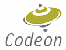

# mulle-lldb

This is a debugger based on the future llvm 5.0, written for the mulle-objc
runtime. The debugger can be used to debug Objective-C code produced by the
**mulle-clang** compiler 4.0.0.2 or better and requires the mulle-objc runtime
0.7.1 or better.

## Install

### Manually

* [INSTALL.txt](NSTALL.txt)

## Author

[Nat!](//www.mulle-kybernetik.com/weblog) for
[Codeon GmbH](//www.codeon.de)
